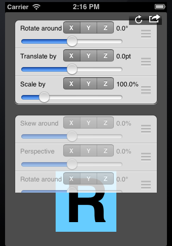

# Transformifier

Generic Interactive 3D Transformation Tweaking Tool for iOS Development

**The scenario:**
Your designer hands you psd or png files to skin the app. 

No problem. except there's this element that's like this original element, except it's skewed just so. 

The gotcha: the element is dynamic at runtime.  Thus, you can't simply save the designer's sample as a static png. You must render and recreate the skew in code.

And no, the transformation values are not available, since they were applied freehand in Photoshop.

**One approach**
After spending an inordinate amount of time applying a series of transforms in a never-ending trial-and-error nightmare, you realize it's not a simple 2D skew, or even couple of 3D axis rotations. What the heck did the designer do?

**The solution:**
Temporarily install and instantiate a Transformifier. Set to act on the CALayer of the victim element on the screen, and interactively set functions and values until you get exactly the desired effect. Click the output icon to get fully formed, ready to paste text to replicate the effect in code.

### Installation:

1 Copy the 2 files in the Transformifier folder and add them to your project:

	* Transformifier.h
	* Transformifier.m
	
2 Add this line to the UIViewController's implementation file where you need some transformication:

	* #import "Transformifier.h"

3 Ensure QuartzCore.framework is part of the project, and #import <QuartzCore/QuartzCore.h> as appropriate.

4 Instantiate a Transformifier and add it's view to your viewcontroller's superview.

5 Optionally set the transformifier's yOffset or height properties to allow a better view of the UI element being transformified.

### Example code usage:

	- (void)viewDidAppear:(BOOL)animated {
		[super viewDidAppear:animated];

		self.transformifier = [[Transformifier alloc] initForLayer:victimLabel.layer];
		[self.view.superview insertSubview:transformifier.view aboveSubview:self.view];
	}

### Tool usage:

* The transformifier instantiates as a UITableView with 2 sections. 
	* The first section contains the active transforms, while the second is used as a source of new transforms or a dump of unneeded transforms.

* Each row in the table describes what that transform does. 
	* Use the slider to adjust the amount of transformation, and the segmented control to choose which axis to act upon.

* Move rows from the source section to the active section to add a new transform. 
	* Move rows from the active section to the source section to remove its effect. 
	* The source section will always contain one of each type of transform regardless of what you move out or into it. 
	* You can add as many transforms as you need to achieve the affect you need.

* Since some transforms are not commutative, you may reorder them in the active section to get a different effect. 
	* Reordering rows in the source section has no effect, except possibly placing a frequently used transform within easier reach.

* If you get tangled up, click the reload button to tango on.

* Once your target effect is achieved, click the actions button to reveal the code needed to replicate it.
	* Click in the new visible UITextView to copy its contents to the iOS pasteboard in the simulator
	* Press ⌘-c to copy the code to the OSX clipboard, then paste it into xcode.
	* There are 3 types of output:
		* A human-readable description of all the transforms applied
		* A set of CATransform3D functions to replicate the transforms in code
		* A single CATransform3D transform containing the final, concatenated effect of the active transforms.
	* Use either the step-by-step transform functions or the final aggregate to apply to your target UI element's layer.

